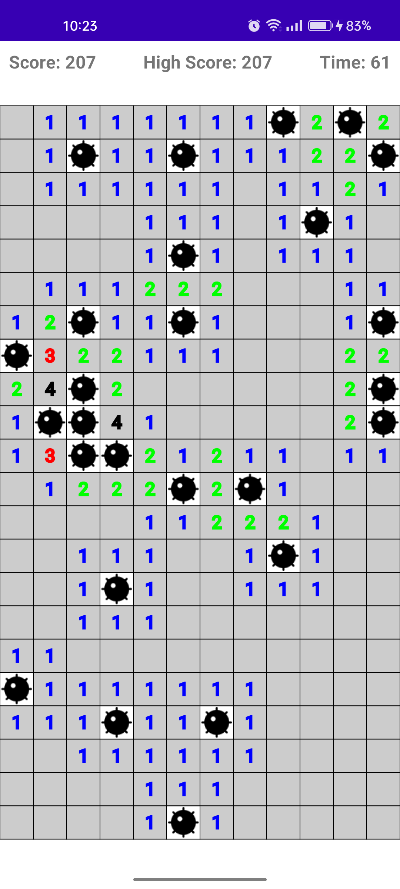
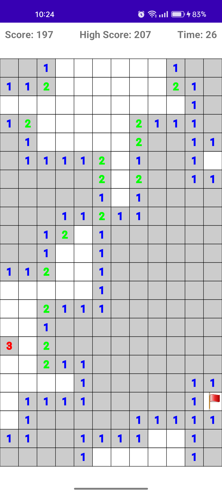
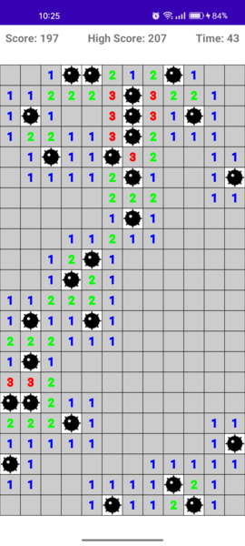

# Minesweeper for Android

A classic Minesweeper game for Android, written in Kotlin. This project provides a clean and intuitive interface for players of all skill levels.

## Features

- Custom `MineSweeperView` for game board rendering
- Swipe-to-refresh functionality for easy game resetting
- Timer to track elapsed time during gameplay
- Score tracking based on mines flagged correctly
- High score persistence using `SharedPreferences`
- Implements interfaces for score updates and game end events

## Installation

Clone the repository and open the project in Android Studio. Build and run the app on an emulator or connected device.

## Contributing

Pull requests are welcome. For major changes, please open an issue first to discuss what you would like to change.

## License

[MIT](https://choosealicense.com/licenses/mit/)
